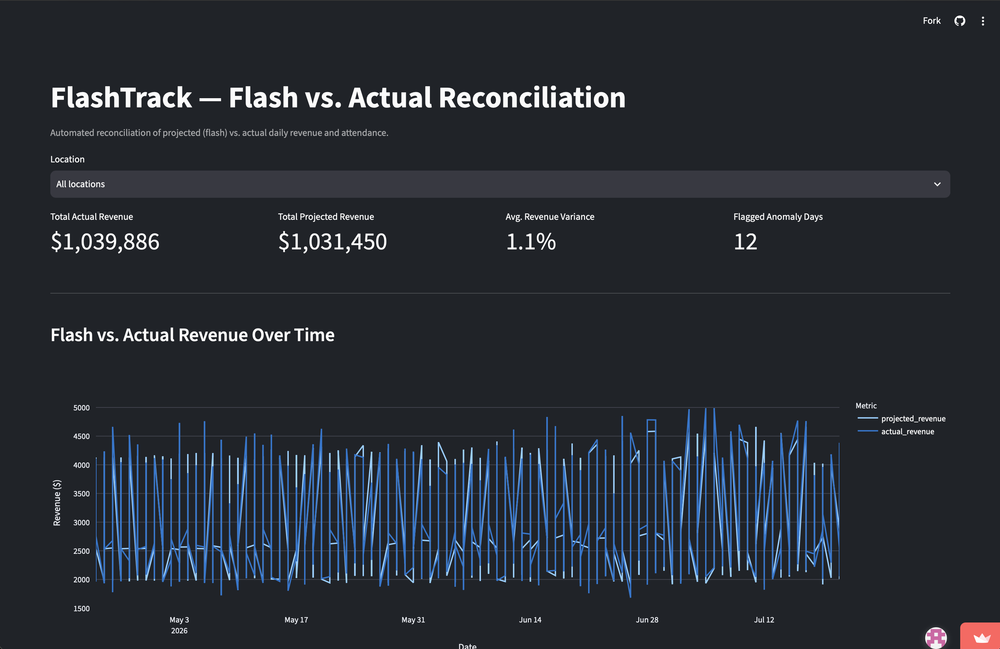

# FlashTrack

**Automated reconciliation of projected (flash) vs. actual daily revenue and attendance — built to replace a manual Excel process I ran as an Assistant Manager with a real, scheduled data pipeline.**

🔗 **Live dashboard:** [flash-track-ge4qqhff4xxcb5jmebtk5s.streamlit.app](https://flash-track-ge4qqhff4xxcb5jmebtk5s.streamlit.app)



## The problem

At my job, I reconciled "flash" (projected) numbers against actual daily performance by hand in Excel — cross-checking spreadsheets, flagging discrepancies, and reporting variance to management. It worked, but it didn't scale, wasn't automated, and had no systematic way to flag anomalies beyond eyeballing the numbers.

FlashTrack rebuilds that workflow as a real data pipeline: synthetic membership/revenue data flows through Postgres, gets validated and checked for anomalies by an orchestrated Airflow pipeline, and surfaces in a live dashboard — all deployed to the cloud.

## Architecture

```
generate_data.py (synthetic data with realistic noise)
        │
        ▼
   PostgreSQL  ──────────────► Neon (cloud) for production
   (locations, members,            │
    daily_flash, daily_actuals)    │
        │                          │
        ▼                          ▼
  SQL views (daily_variance,   Streamlit dashboard
  flagged_anomalies)           (deployed on Streamlit
        │                       Community Cloud)
        ▼
  Airflow DAG (daily, scheduled)
   1. ingest_daily_data  — generates a new day of data
   2. validate_data      — fails loudly on missing/invalid rows
   3. check_anomalies    — logs any flagged variance
```

Everything runs in Docker locally (Postgres + Airflow); the dashboard and its database run in the cloud (Streamlit Community Cloud + Neon) so it's reachable without anyone needing to clone the repo.

## Tech stack

| Layer | Tool |
|---|---|
| Language | Python, SQL |
| Database | PostgreSQL (local: Docker, cloud: Neon) |
| Orchestration | Apache Airflow (LocalExecutor) |
| Dashboard | Streamlit + Plotly |
| Infra | Docker, Docker Compose |
| CI/CD | GitHub Actions (lint + automated tests on every push) |

## What it does

- **Generates realistic synthetic data** for 4 locations over 90 days, with actuals diverging from flash projections via random noise (~8% std dev) to simulate real-world variance.
- **Computes variance automatically** via SQL views (`daily_variance`, `flagged_anomalies`) rather than manual spreadsheet comparison.
- **Flags anomalies** — any day where revenue variance exceeds ±15% is automatically flagged and categorized as over- or under-projection.
- **Runs on a schedule** — an Airflow DAG ingests a new day of data daily, validates it (failing loudly if row counts or values look wrong), and logs anomalies. This mirrors a real production data pipeline, not a one-off script.
- **Deploys automatically** — every push to `main` triggers GitHub Actions to lint the code and run the test suite before anything ships.

## Running it locally

```bash
git clone https://github.com/kverna16/flash-track.git
cd flash-track
python -m venv venv
source venv/bin/activate
pip install -r requirements.txt

# Start the local database
docker compose up -d

# Generate synthetic data
python generate_data.py

# Start Airflow (separate compose file — this is a heavier stack)
docker compose -f docker-compose-airflow.yml up airflow-init
docker compose -f docker-compose-airflow.yml up -d
# Airflow UI: http://localhost:8080 (admin/admin)

# Run the dashboard
streamlit run dashboard.py
```

## What I'd build next

- **Statistical anomaly detection** instead of a fixed ±15% threshold — a z-score relative to each location's own historical variance would catch anomalies more precisely than one flat cutoff for every location.
- **Per-location faceting on the trend chart** — right now "All locations" overlays four locations' raw daily data on a single line, which reads as noisy; breaking it into small multiples or an aggregated daily total would be cleaner.
- **Weekend/seasonal patterns** in the noise model — the current version uses pure random noise; real gym attendance has weekly cyclicality that would make the anomaly detection more realistic.
- **Slack/email alerting** from the Airflow `check_anomalies` task instead of just logging to console.

## Why I built this

I wanted to prove I could take a manual, spreadsheet-based process I actually run at work and turn it into real infrastructure — a scheduled pipeline with validation, not just a script. Every design decision above (the schema, the noise model, the anomaly threshold) was a deliberate tradeoff I can walk through, not a default I copied.
